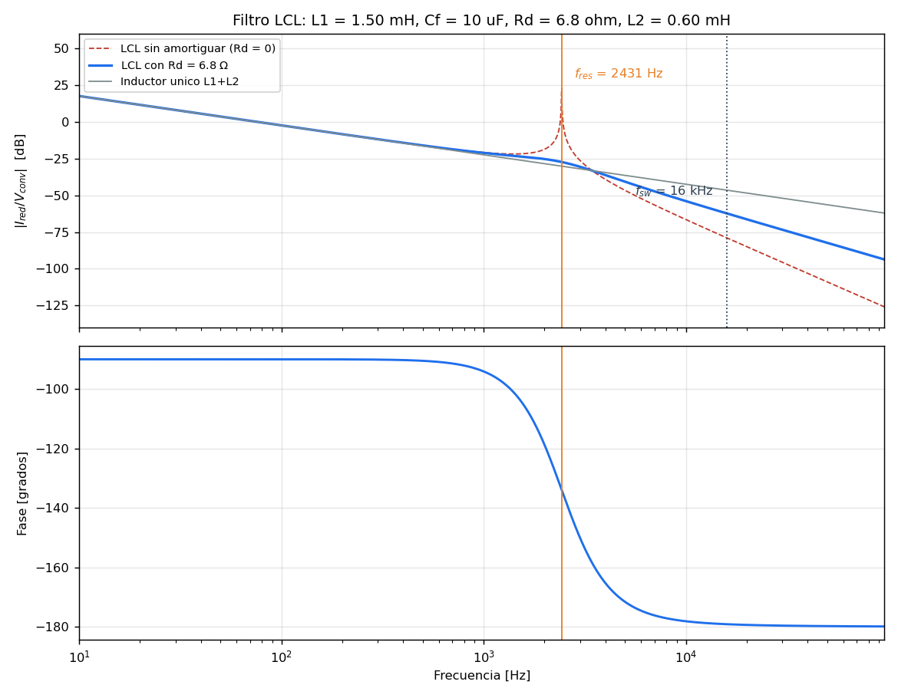
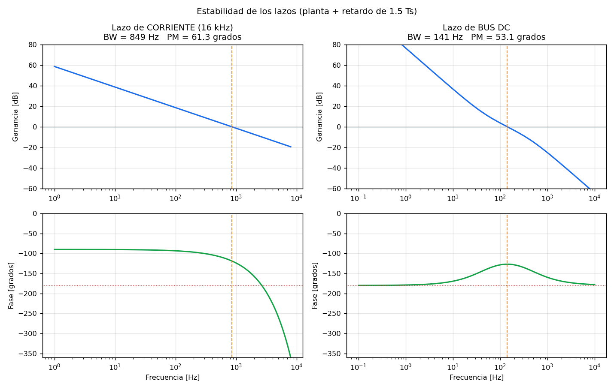
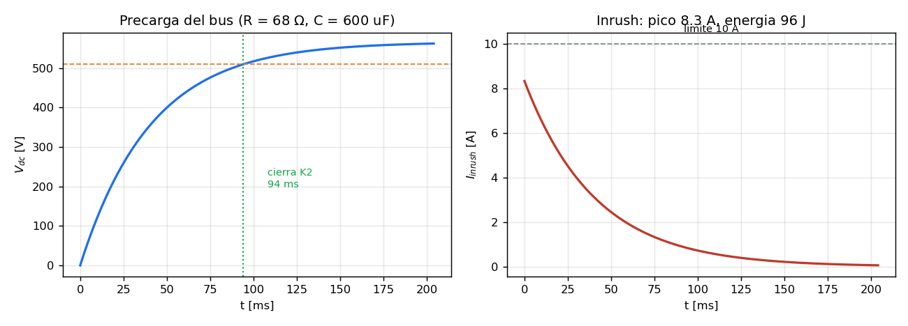
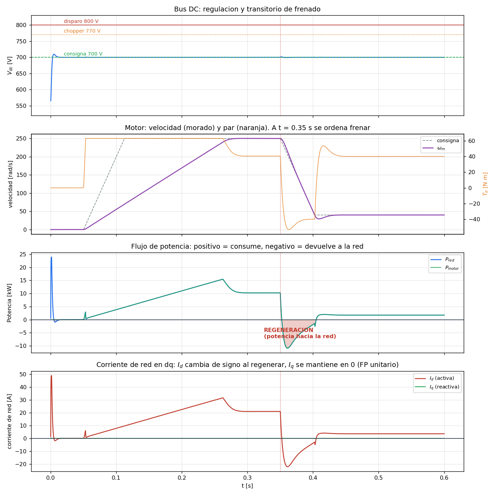
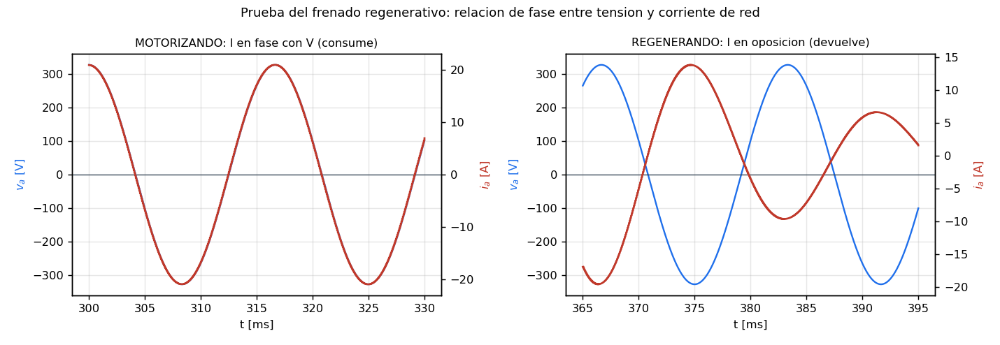

# Informe de validacion del convertidor back-to-back

> Generado por `sim/run_all.py`. No editar a mano: cambia `sim/b2b_params.py` y vuelve a ejecutarlo.

```
PUNTO DE DISENO
  S = 15 kVA | 400 V_LL | 60 Hz | I_n = 21.65 A
  Bus DC = 700 V (max 800 V) | C_bus = 600 uF
  f_sw = 16 kHz | T_s = 62.5 us | dead-time = 500 ns
  LCL: L1 = 1.50 mH | Cf = 10.0 uF | Rd = 6.8 ohm | L2 = 0.60 mH
  SiC: C3M0075120K (75 mOhm) x 12
  Motor: PMSM p=3 lambda=0.35 Wb Kt=1.575 Nm/A J=0.02 kg m2
```

## Resultado global

**31 de 31 comprobaciones OK.**


## 1. Filtro LCL y calidad de red

| | Comprobacion | Valor | Limite | Nota |
|:-:|---|---:|---:|---|
| **OK** | Resonancia LCL | 2431 Hz | 600 .. 8000 | debe estar entre 10*fg y fsw/2 |
| **OK** | Atenuacion extra a f_sw vs L unica | -15.853 dB | -12.000 | compromiso con el amortiguamiento; el criterio normativo real es la THD |
| **OK** | Rizado en L1 (pico-pico) | 11.907 % | 25.000 | 3.65 A sobre 30.6 A pico |
| **OK** | Reactiva del banco Cf | 4.021 % | 5.000 | 603 var |
| **OK** | Pico en resonancia (amortiguado) | 19.200 dB | 20.000 | sin Rd seria 69 dB |
| **OK** | Disipacion en las 3 Rd | 12.202 W | 30.000 | usar 10 W por resistencia |
| **OK** | THD de corriente de red (estimada) | 0.245 % | 5.000 | IEEE 519 / IEC 61000-3-12 |


## 2. Estabilidad de los lazos de control

| | Comprobacion | Valor | Limite | Nota |
|:-:|---|---:|---:|---|
| **OK** | Lazo de corriente: ancho de banda | 849.389 Hz | 800 .. 2667 | Kp = 11.200  Ki = 266.7 |
| **OK** | Lazo de corriente: margen de fase | 61.333 grados | 45.000 |  |
| **OK** | Lazo de corriente: margen de ganancia | 9.934 dB | 6.000 |  |
| **OK** | Lazo de bus DC: ancho de banda | 141.425 Hz | 10 .. 169.9 | Kp = 0.7623  Ki = 225.946 |
| **OK** | Lazo de bus DC: margen de fase | 53.130 grados | 45.000 |  |


## 3. Termico (C3M0075120K, el de la libreria)

| | Comprobacion | Valor | Limite | Nota |
|:-:|---|---:|---:|---|
| **OK** | Perdidas por dispositivo (C3M0075120K) | 28.131 W | 40.000 | cond 22.8 + conm 4.1 + diodo 1.3 |
| **OK** | Perdidas totales de semiconductores | 337.577 W | 400.000 | 12 dispositivos |
| **OK** | Rth disipador-ambiente requerida | 0.162 C/W | 0.150 | por debajo de 0.15 C/W ya no es viable con aire |
| **OK** | Rendimiento estimado | 97.418 % | 96.000 |  |


## 3b. Termico (C3M0040120K, el recomendado)

| | Comprobacion | Valor | Limite | Nota |
|:-:|---|---:|---:|---|
| **OK** | Perdidas por dispositivo (C3M0040120K) | 17.514 W | 40.000 | cond 12.1 + conm 4.1 + diodo 1.3 |
| **OK** | Perdidas totales de semiconductores | 210.169 W | 400.000 | 12 dispositivos |
| **OK** | Rth disipador-ambiente requerida | 0.306 C/W | 0.150 | por debajo de 0.15 C/W ya no es viable con aire |
| **OK** | Rendimiento estimado | 98.231 % | 96.000 |  |


## 4. Precarga del bus

| | Comprobacion | Valor | Limite | Nota |
|:-:|---|---:|---:|---|
| **OK** | Corriente de inrush | 8.319 A | 10.000 |  |
| **OK** | Constante de tiempo de precarga | 40.800 ms | 200.000 | 95 % en 122 ms |
| **OK** | Energia en Rpc por carga | 96.000 J | 400.000 | pico instantaneo 4.7 kW |


## 5. Simulacion temporal + frenado regenerativo

| | Comprobacion | Valor | Limite | Nota |
|:-:|---|---:|---:|---|
| **OK** | Error de regulacion del bus (motorizando) | 0.0006843 % | 1.000 | media 700.0 V |
| **OK** | Rizado del bus en regimen | 0.00455 % | 2.000 |  |
| **OK** | Pico de bus durante el frenado | 701.611 V | 800.000 | chopper en 770 V, disparo en 800 V |
| **OK** | Factor de potencia en la red | 1.000  | 0.990 | Id = 21.06 A, Iq = -0.000 A |
| **OK** | Potencia de red motorizando | 10.315 kW | 0.000 | positiva = consume de la red |
| **OK** | Potencia de red frenando | -5.938 kW | 0.000 | NEGATIVA = devuelve a la red (regenera) |
| **OK** | Error maximo del PLL tras enganche | 6.183e-12 grados | 1.000 |  |
| **OK** | Error de velocidad en regimen | 9.368e-05 % | 2.000 | 250.0 rad/s de 250 rad/s |


## Ganancias resultantes (llevar al firmware)

```c
/* Lazo de corriente del AFE y del inversor, 16 kHz */
#define KP_I     11.200000f
#define KI_I     266.666667f
/* Lazo externo de tension de bus */
#define KP_VDC   0.762316f
#define KI_VDC   225.946265f
#define TS       0.000062500f  /* 62.50 us */
```


## Figuras

### Respuesta del filtro LCL: resonancia, amortiguamiento y atenuacion a f_sw.



### Bode de lazo abierto de los lazos de corriente y de bus, con el retardo de 1.5 Ts.



### Transitorio de precarga: tension de bus e inrush.



### Simulacion completa: bus, motor, flujo de potencia y corriente dq de red.



### Prueba del frenado regenerativo: la corriente de red se invierte.


